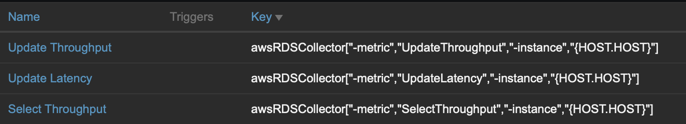
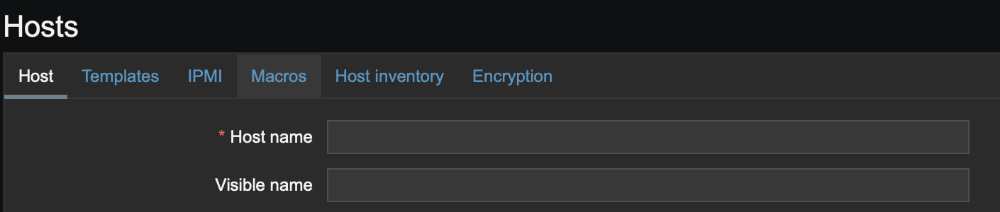

# zabbix-RDS-watcher
AWS-GO-SDK를 활용하여 Aurora RDS에 대한 CloudWatch Metric을 Zabbix로 불러올수 있는 프로그램 입니다. 

## Release
### v1.0
+ RDS Metric Collect

### v2.0
+ Redshift에 대한 Metric 수집이 추가되었습니다. 
    + Support Metric 
        + CommitQueueLength
        + ConcurrencyScalingActiveClusters
        + CPUUtilization
        + DatabaseConnections
        + HealthStatus
        + MaintenanceMode
        + MaxConfiguredConcurrencyScalingClusters
        + NetworkReceiveThroughput
        + NetworkTransmitThroughput
        + PercentageDiskSpaceUsed
        + ReadIOPS
        + ReadLatency
        + ReadThroughput
        + TotalTableCount
        + WriteIOPS
        + WriteLatency
        + WriteThroughput
    + Metric은 Cluster Identifier 기준입니다.
+ Arg 추가 및 변경
    + 변경
        + -instance -> -identifier
    + 추가
        + "-class" Value값은 RDS / REDSHIFT
    


## Import
```
go get github.com/aws/aws-sdk-go/aws
```

## Configure
```
// AWS KEY
accKey 	:= ""
secKey	:= ""
```
Flag로 Key를 처리하는 경우 Zabbix 서버 프로세스상 Key가 노출되기 때문에 코드 내부에 작성.


## Complie
```
GOOS=linux go build main.go
```

## View Metric
### RDS Metric
+ FreeableMemory
+ FreeLocalStorage
+ CPUUtilization
+ CommitThroughput
+ DDLThroughput
+ DMLThroughput
+ InsertThroughput
+ SelectThroughput
+ DeleteThroughput
+ UpdateThroughput
+ ActiveTransactions
+ DatabaseConnections
+ Deadlocks
+ AbortedClients
+ Queries
+ RowLockTime
+ EngineUptime
+ InsertLatency
+ SelectLatency
+ UpdateLatency
+ DeleteLatency
+ DDLLatency
+ DMLLatency
+ CommitLatency
+ AuroraReplicaLag
+ ForwardingMasterDMLLatency
+ ForwardingReplicaDMLLatency
+ ForwardingReplicaReadWaitLatency
+ ForwardingReplicaSelectLatency
+ ForwardingMasterDMLThroughput
+ ForwardingReplicaDMLThroughput
+ ForwardingReplicaReadWaitThroughput
+ ForwardingReplicaReadWaitThroughput

### Redshift Metric
+ CommitQueueLength
+ ConcurrencyScalingActiveClusters
+ CPUUtilization
+ DatabaseConnections
+ HealthStatus
+ MaintenanceMode
+ MaxConfiguredConcurrencyScalingClusters
+ NetworkReceiveThroughput
+ NetworkTransmitThroughput
+ PercentageDiskSpaceUsed
+ ReadIOPS
+ ReadLatency
+ ReadThroughput
+ TotalTableCount
+ WriteIOPS
+ WriteLatency
+ WriteThroughput

## Zabbix Usage
Zabbix에 Item 등록시 Key 부분에 아래와 같이 작성.

```
zabbixRDSWatcher["-metric","{Metric Name}","-instance","{HOST.HOST}"]
```
+ {Metric Name} : 위에서 수집하려는 Metric Name
+ {HOST.HOST}   : Zabbix Host에 추가된 서버의 Name
> 해당 프로그램은 Zabbix Host에 RDS 등록 시  Host name 부분에 DBInstanceIndentier를 넣어야 합니다.
